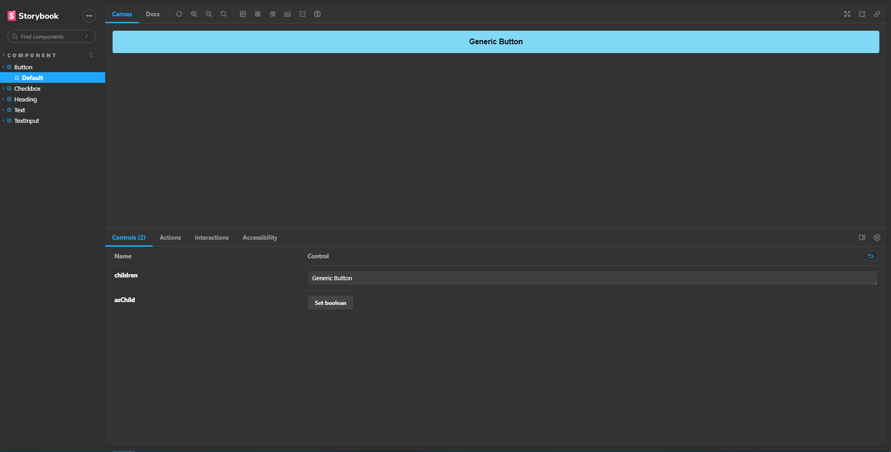
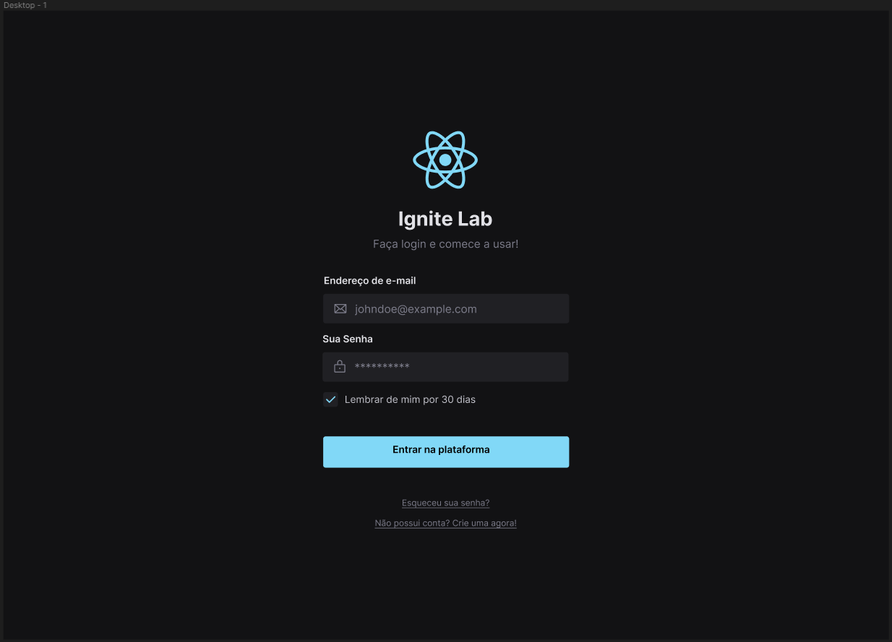

<h1 align="center"> Design System - Ignite Labs </h1>

Evento exclusivo e gratuito, promovido pela Rocketseat para ensino de tecnologias WEB.

  <a href="#-tecnologias">Tecnologias</a>&nbsp;&nbsp;&nbsp;|&nbsp;&nbsp;&nbsp;
  <a href="#-projeto">Projeto</a>&nbsp;&nbsp;&nbsp;|&nbsp;&nbsp;&nbsp;
  <a href="#-layout">Layout</a>&nbsp;&nbsp;&nbsp;|&nbsp;&nbsp;&nbsp;
  <a href="#memo-licença">Licença</a>

  

 

  

  

## 🚀 Tecnologias

Esse projeto foi desenvolvido com as seguintes tecnologias:

- [React](https://reactjs.org/)
- [TypeScript](https://www.typescriptlang.org/)
- [Node e NPM](https://nodejs.org/)
- [Vite](https://vitejs.dev/)
- [iMask](https://imask.js.org)
- [Figma](https://www.figma.com/)
- [Storybook](https://storybook.js.org/)
- [Storybook Jest](https://www.npmjs.com/package/@storybook/jest)

## 💻 Projeto

O projeto feito no Ignite Lab 03 consiste na criação de um design system, onde foi possível o aprendizado das ferramentas descritas acima e a criação da página de login como consta no prototipo.

## 🔖 Layout

Você pode visualizar o layout do projeto através [DESSE LINK](https://www.figma.com/file/N7qEJypG5EuhhMMe8eRKAt/Ignite-Lab-Design-System?node-id=0%3A1). É necessário ter conta no [Figma](https://figma.com) para acessá-lo.
Também é possivel acessar o Storybook através [DESSE LINK](https://edsonjunior1.github.io/ignite-lab-design-system/?path=/story/component-button--default).

## :memo: Licença

Esse projeto está sob a licença MIT.

---
